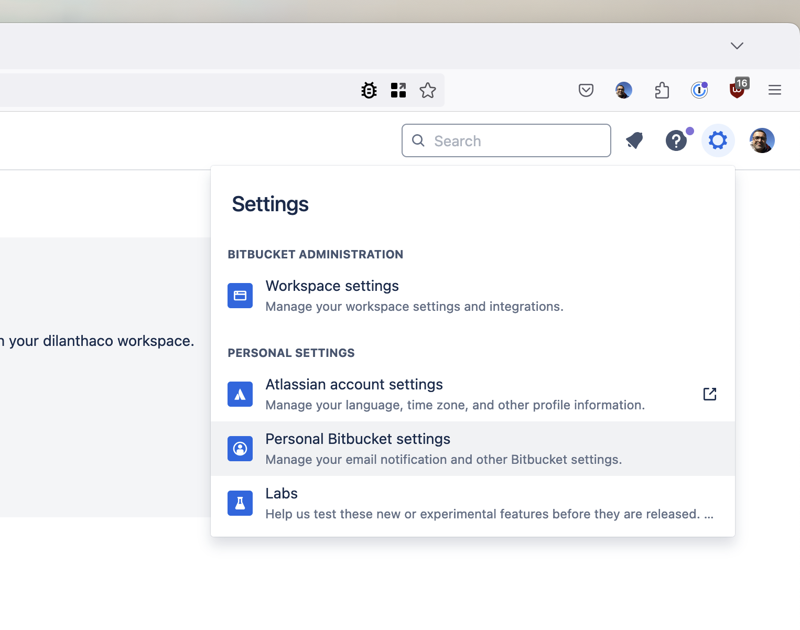
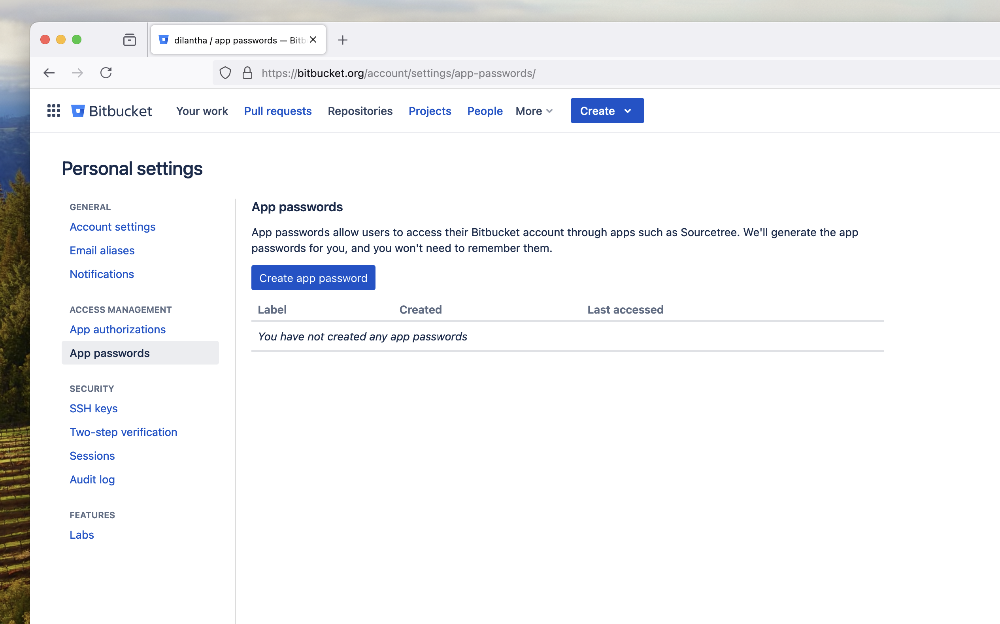
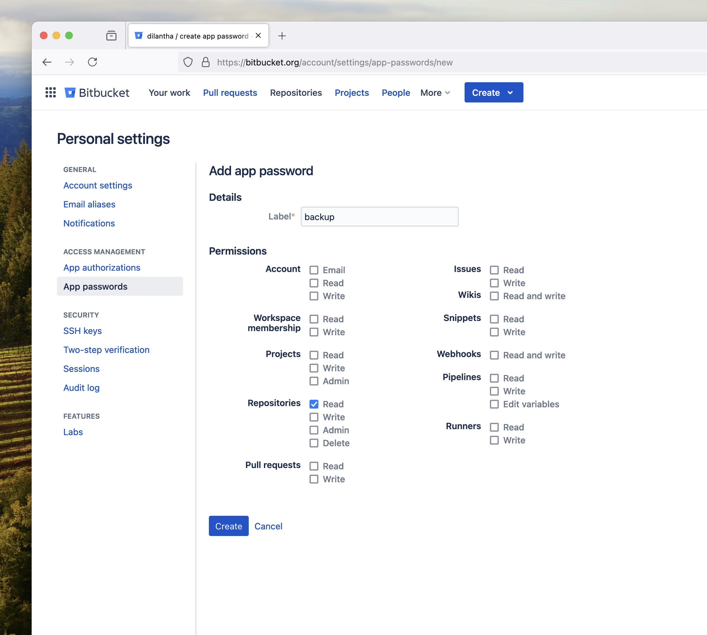

# Clone Bibucket Repositories

Clone Bitbucket repos like a pro.

Install [gum](https://github.com/charmbracelet/gum?tab=readme-ov-file#installation) and run the command to clone all your repos.

```shell
bash clone_bitbucket_repos.sh -d /path/to/clone/repositories
```

This will ask for your username, app password and workspace name.

See the following steps to create an app password.





